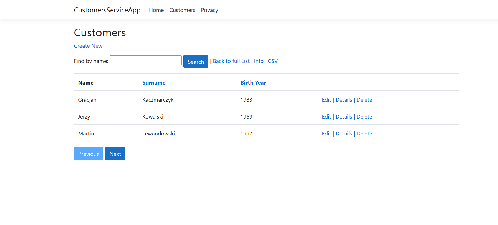
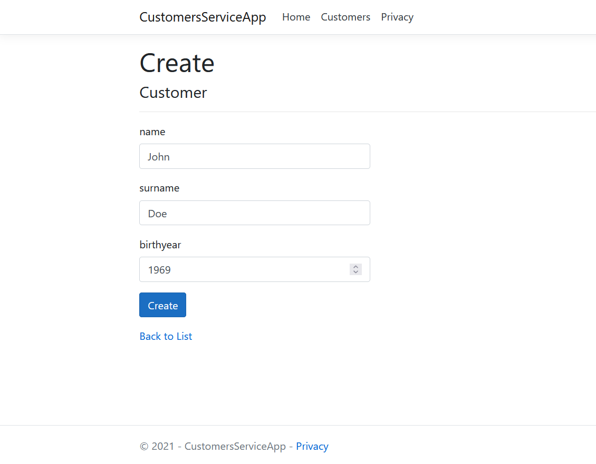
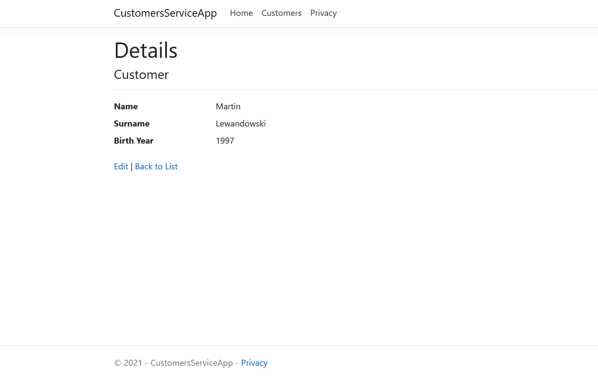
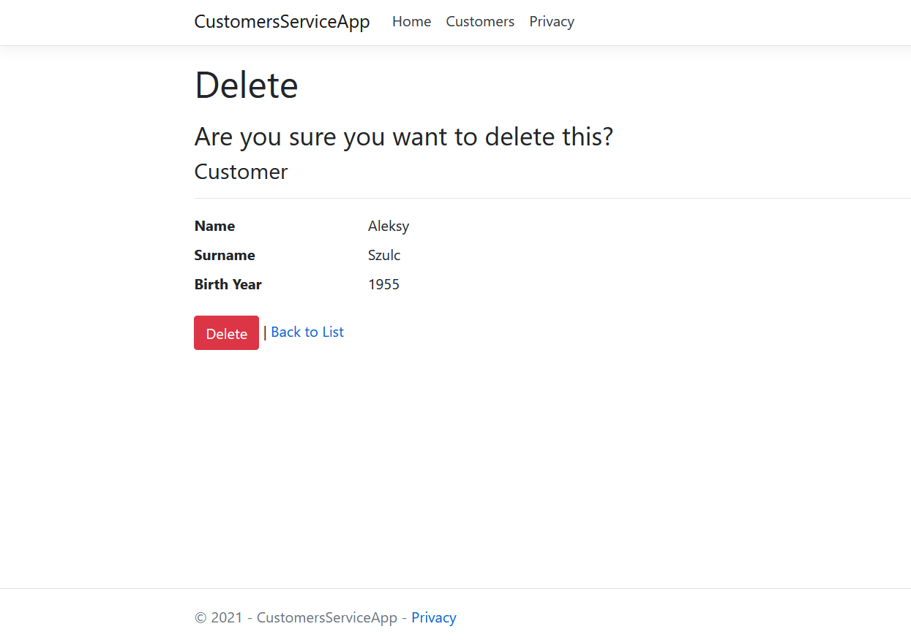
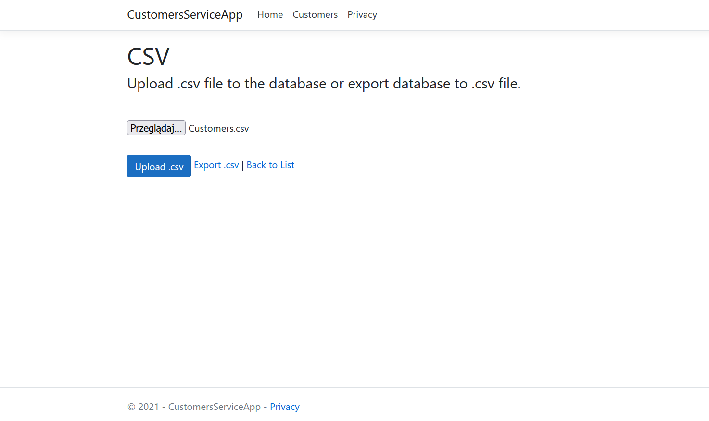

# CustomersServiceApp

## Table of Contents
* [General Info](#general-information)
* [Technologies Used](#technologies-used)
* [Features](#features)
* [Screenshots](#screenshots)
* [Setup](#setup)
* [Project Status](#project-status)
* [Contact](#contact)

## General Information
The CustomersServiceApp is an application that maintains the CustomersDb database using CRUD methods.

## Technologies Used
- ASP .NET Core Razor Pages
- Entity Framework
- Jquery 3.4.1
- Bootstrap 4
- PostgresSQL (localhost)/MS SQL Server 2019 (on SmarterASP.NET server)

## Features
- Viewing, editing, adding and deleteing customers from the database.
- Viewing details of each customer.
- Importing database table into .csv file.
- Exporting datable from .csv file into database.

## Screenshots

## Setup
In case running application using localhost use PostgreSQL database (connectionstring is included in project).
Or configure your own data base with table customer {id (int) (PRIMARY KEY), name (varchar 50), surname (varchar 50), birthyear (int)}.

## Project Status
Project is: _complete_ 

## Contact
Created by [@bTusinski](https://github.com/bTusinski/) - feel free to contact me!
